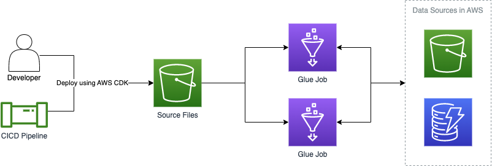

# Deploy Multiple Glue Jobs Using Shared Code with CDK

This example code demonstrate how to automate the deployment of multiple glue jobs that utilize shared code together with CDK.

## Motivation

When writing multiple AWS Glue jobs, it is necessary to create a script file for each Glue job. The the naive approach where developers create independent scripts will quickly lead to violations of DRY principles. Using shared code between AWS Glue Jobs requires the user to create a deployment package (either a Zip file, Wheel, or Egg) and upload it to S3. Updating this deployment package then requires it to be rebuilt and uploaded again. This means that sharing code requires a mechanism to build and upload an artifact, instead of just uploading the source script. Then Glue jobs need to be configured to use the uploaded artifact in addition to the source script.

Automating this process will allow developers to write code faster without thinking about how their code is packaged and deployed. It also needs to be automated in order to be built and deployed by CICD tools such as Jenkins.

Building this solution with the CDK allows users to use CloudFormation to automate the deployment and manage access control for all their related resources. For example, this might include a Glue database, S3 buckets, or DynamoDB tables.

## Solution

This solution uses NPM features to give users one `npm run build` command that builds all code, Typescript and Python. Underneath, it uses Pipenv to install Python dependencies and a `setup.py` to declare the package that will be built. When the build command runs, it creates a Wheel that will be uploaded to S3 when the CloudFormation is deployed. The location of the Wheel will not change in a CICD environment. This means that if you test locally, the relative file path and file name used to deploy with be the same.

This code contains a custom CDK construct to automatically create an IAM Role for Glue to assume with access to Script and Wheel files. The user provides the file location of the script and the location of the Wheel and the CDK will upload them to S3 when it deploys. Once uploaded, the Glue Jobs will run using the code assets from S3. This will upload the normal script file, but it also uploads a Python Wheel that is referenced in the Glue job configuration as an extra Python file. This is where Glue downloads the extra python code that is outside of the main script.



This example has a small utility in `glue/src/utils/utils.py` that both Glue jobs use to manipulate S3 paths. This allows both deployed Glue jobs to share the code that is not strictly related to their business logic.

## Prerequisites

    - Install [Node and NPM](https://docs.npmjs.com/downloading-and-installing-node-js-and-npm)
    - Install [Python 3.7](https://www.python.org/downloads/)
    - Install [pipenv](https://pipenv.pypa.io/en/latest/)

## Deploying

From the project root directory run the following commands:

First, run

```
npm install
```

To install all node libraries need by the project.

Then run

```
npm run build
```

This will compile all Typescript code, then it will install Python libraries

To deploy the CloudFormation stack, run

```
npm run cdk -- deploy
```

This will take the build artifacts generated in the build step and upload them to S3. Then it will deploy the Cloudformation stack containing the Glue jobs that utilize the shared code in `glue/src/utils`

## Testing

This example comes with a test script to download Ol' Faithful geyser data and upload it to an S3 Bucket created by this stack. Then there are two Glue Jobs. One will take the downloaded CSV data and convert it to Apache ORC format, the other will read the ORC data and write to a DynamoDB table created by the CDK.

After running `npm run cdk -- deploy` note the name of the S3 Bucket that was output and then run

```
npm run upload-data -- [Bucket Name Here]
```

Then you can navigate to the Glue console in AWS. First run the job `ConvertCsvtoOrc`. Then when the job is complete, run the job `LoadToDatabase`. When both jobs are complete, navigate to the DynamoDB output by the CDK and inspect the Table. There should be records created with 3 columns, `Index`, `Eruption length (mins)`, and `Eruption wait (mins)`

## Clean up

All databases and S3 have removal policies set to automatically delete any objects in S3, then delete both the S3 bucket and DynamoDB Table created by this stack. To destroy all resources created run:

```
npm run cdk -- destroy
```

The S3 Bucket and DynamoDB are provided as outputs, so it is possible to double check that they are actually deleted

## Contributing

See [CONTRIBUTING](CONTRIBUTING.md#security-issue-notifications) for more information.

## License

This library is licensed under the MIT-0 License. See the LICENSE file.
